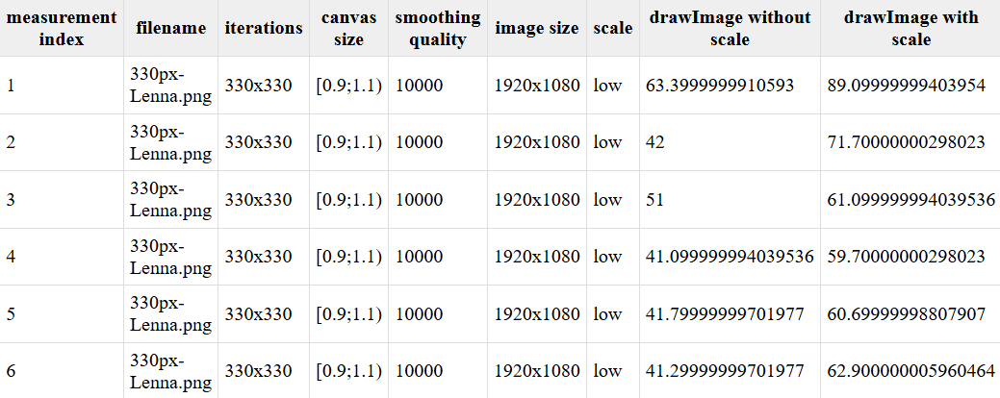

# Scale performance of drawImage

## Introductions
This article explores [recommendation from mdn](https://developer.mozilla.org/en-US/docs/Web/API/Canvas_API/Tutorial/Optimizing_canvas#dont_scale_images_in_drawimage) about image scaling by the CanvasRenderingContext2D.drawImage().

>Don't scale images in drawImage


We ran tests with dynamic image scaling versus drawing without scaling.

Spoiler: *in all cases there is either minimal or no difference*.

## Methodological research

We used JS in conjunction with HTML so we could test the theory on our inputs:
+ URL of an image
+ count of iterations
+ height of the canvas 
+ width of the canvas 
+ imageSmoothingQuality
+ Random scale range


```JS
function drawImageWithoutScale() {
    const start = performance.now();
    for (let i = 0; i < iterationsCount; i++) {
        let x = Math.random() * canvas1.width;
        let y = Math.random() * canvas1.height;
        ctx2.drawImage(image, x, y);
    }
    const end = performance.now();
    let time = end - start;
    return time;
}

function drawImageWithScale() {
    const start = performance.now();
    for (let i = 0; i < iterationsCount; i++) {
        let x = Math.random() * canvas1.width;
        let y = Math.random() * canvas1.height;
        let scaleParameter = Math.random() * (rangeTo - rangeFrom) + rangeFrom;
        ctx1.resetTransform();
        ctx1.scale(scaleParameter, scaleParameter);
        ctx1.drawImage(image, x, y);
    }
    const end = performance.now();
    let time = end - start;
    return time;
}
```

The rendering with and without scaling in two different canvases is run according to the specified parameters, the time measurements are displayed in a table.

Example:


You can take measurements with your values

<iframe src="./scale/index.html"></iframe>

## Measurement results

| # | filename  | iterations | canvas size | smoothing quality | image size | scale | drawImage without scale | drawImage with scale |
|---|-----------|------------|-------------|-------------------|------------|-------|-------------------------|----------------------|
| 1 | Lenna.png | 330x330    | [0.9;1.1)   | 10000             | 1920x1080  | low   | 31.1                    | 50                   |
| 2 | Lenna.png | 330x330    | [0.9;1.1)   | 10000             | 1920x1080  | low   | 23.39                   | 46.8                 |


## Analyzing measurement results

+ The difference in time is noticeable only at 1000+ iterations.

+ No significant performance slippages were detected with scale().

+ When using modern browsers, engine-level optimization probably smoothes out the differences.


## Conclusion
The mdn recommendation that using scale() is a slow operation can be considered outdated and irrelevant, since in the current realities the GPU speeds up such calculations.
The above synthetic measurements for 1000+ iterations may show a slight increase in time when using scaling, but under normal conditions this difference will be completely unnoticeable and will not affect the user experience.

<!-- указать ссылку на код -->

<a href="" target="_blank">
  
</a>