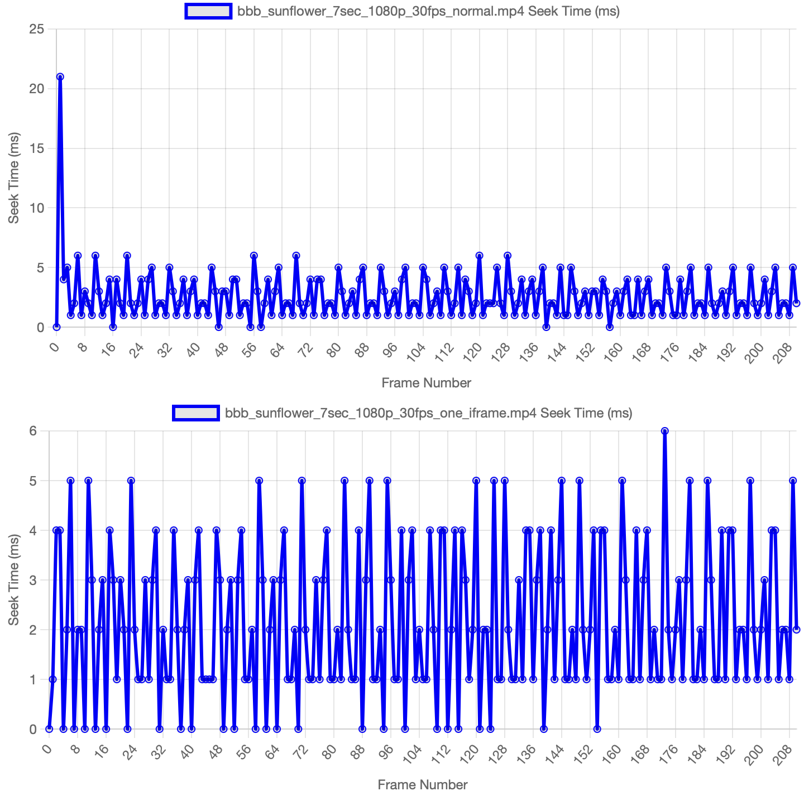

<p class="lead">
    In this article we will measure performance of seeking with HTMLVideoElement.
</p>

## Why is this important?
Let's say we are building a video editor application. In the video editor user can upload it's own video, apply some effects, transformations, etc. and then render the final video.
When rendering happens we should render the video frame by frame, which means we should seek to the specific time and then render the frame.


## How to seek html video element?

To seek to a specific time in the video we can use `currentTime` property of the video element.

```javascript
const video = document.querySelector('video');
video.currentTime = 10; // Seek to 10th second
```

but this is not correct, because seeking is an asynchronous operation. So we should listen to `seeked` event to know when seeking is done

```javascript
const video = document.querySelector('video');
video.currentTime = 10; // Seek to 10th second
video.addEventListener('seeked', () => {
  console.log('Seeking is done');
});
```

or lets make it generic

```javascript
async function seek(videElement, currentTime) {
    return new Promise((resolve) => {
        const listener = () => {
            videElement.removeEventListener('seeked', listener);
            resolve()
        }
        videElement.addEventListener('seeked', listener);
        videElement.currentTime = currentTime;
    });
}

await seek(video, 10);
```

## Performance measurement tool

In this demo you can chose video you like, edit timestamps and run the test.


<div>
    <demo-with-playground
        file="mediaSource/index.html"
        initialPath="./mediaSource/index.html"
    />
</div>


## Test videos

There are links to standard video files, but you can also upload your own video.

For tests we will use [big buck bunny](http://bbb3d.renderfarming.net/download.html) video files with different resolutions and frame rates, iframes density, etc.

Info about the video files:




### Conclusion

Chromium seek operation has O(n) complexity. Which means O(n^2) complexity to get all frames in the video;
To prove it I created a video with only one I-frame. This video has 301 frames and 7 seconds duration. The video is encoded with 30 fps, which means it has 210 frames per second. The video is encoded with 9999 keyframes, which means it has only one I-frame.

You can use this 2 videos to test the performance of seeking

[normal video](https://media.githubusercontent.com/media/stepancar/articles/main/articles/html-video-element-seeking/mediaSource/test-videos/bbb_sunflower_7sec_1080p_30fps_normal.mp4) contains 3 iframes


[video with one i-frame](https://media.githubusercontent.com/media/stepancar/articles/main/articles/html-video-element-seeking/mediaSource/test-videos/bbb_sunflower_7sec_1080p_30fps_one_iframe.mp4) contains only one iframe

this video was creted by using ffmpeg command:

```bash
ffmpeg -i bbb_sunflower_7sec_1080p_30fps_normal.mp4 \
  -c:v libx264 -g 9999 -keyint_min 9999 -sc_threshold 0 \
  -force_key_frames "0" -pix_fmt yuv420p \
  -preset fast -crf 18 \
  bbb_sunflower_7sec_1080p_30fps_one-iframe.mp4
```

On my machine running this experiment showed such results:


| Browser  | Video Type              | Total Frames | Total Time (ms) | Seeking Time per Frame (ms) | Seeking FPS |
|----------|-------------------------|--------------|------------------|------------------------------|-------------|
| Chromium | Normal                  | 301          | 5561.60          | 18.48                        | 54.12       |
| Chromium | Normal (1 I-frame)      | 301          | 9485.30          | 31.51                        | 31.73       |
| Safari   | Normal                  | 301          | 595.00           | 2.81                         | 355.87      |
| Safari   | Normal (1 I-frame)      | 301          | 471.00          | 2.23                        | 448.43      |

On this chart you can see how the seeking time is growing with the number of frames in the video.

Chromium
[](./static/seekTimeChartChromium.png)

Safari
[](./static/seekTimeChartSafari.png)


[chromium issue](https://issues.chromium.org/issues/418456081)

You can also compare performance with `Preload to blob storage` option.
This option will preload video to blob storage and then you can seek to any time in the video without waiting for the video chunk to be loaded.
