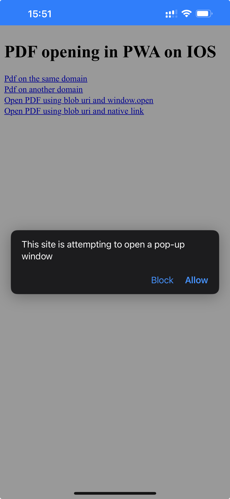

### PDF in PWA

When you are developing a PWA for iOS, you may encounter a problem with PDF files. When you click on a PDF link, it will be opened in in-app browser right inside your PWA.

<table>
    <tr>
        <th>File on the same domain</th>
        <th>File on another domain</th>
        <th>window.open blob uri</th>
        <th>native link with blob uri</th>
    </tr>
    <tr>
        <td style="width:25%">
            
        </td>
        <td style="width:25%">
            
        </td>
        <td style="width:25%">
            
        </td>
        <td style="width:25%">
            
        </td>
    </tr>
</table>

See it in action:
Install PWA from [this link](https://stepancar.github.io/articles/articles/pwa-open-pdf/src/)

<demo-with-playground
    file="src/index.html"
    initialPath="./src/index.html"
/>
